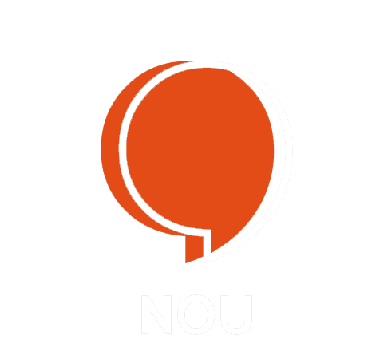

> _Assignees : Luca SARDELLITTI | Florian BERROT | Antoine MOUSSET_

### Project description :bookmark_tabs:

> This project is a webapp of the NOU project.

[](https://vuejs.org/v2/guide/)  
[](https://vuetifyjs.com/en/getting-started/installation/)

_More informations :_

| VueJS | Vuetify | 
| ------ | ------ |
| [](https://vuejs.org/v2/guide/)  |  [](https://vuetifyjs.com/en/getting-started/installation/) |

## Project setup
```
yarn install
```

### Compiles and hot-reloads for development
```
yarn serve
```

### Compiles and minifies for production
```
yarn build
```

### Lints and fixes files
```
yarn lint
```

### Customize configuration
See [Configuration Reference](https://cli.vuejs.org/config/).
